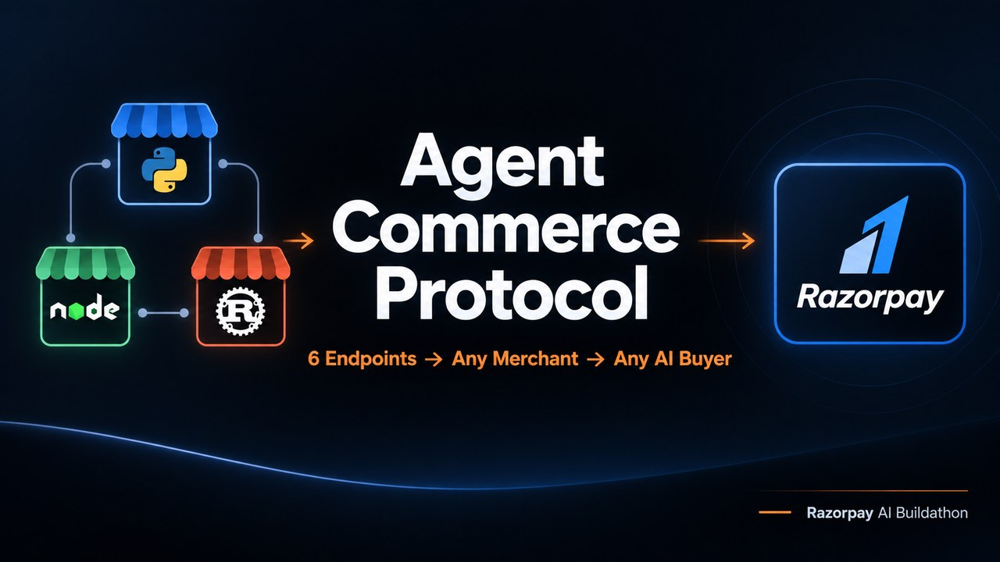
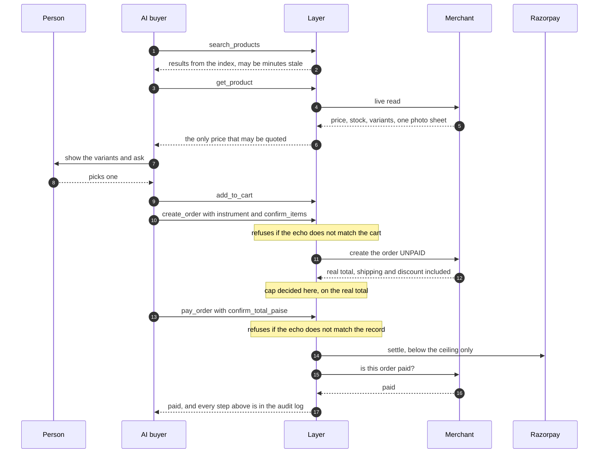

# Agent Commerce Protocol

**A specification that makes any merchant transactable by any AI buyer, and a layer that
speaks it.**


Built for the Razorpay AI Buildathon, Track 01: *"an agent that makes a merchant
transactable by an AI buyer end to end."*

## Demo video

[](https://youtu.be/GTKDtKJNZfg)

**▶ [Watch the five-minute demo](https://youtu.be/GTKDtKJNZfg)**. It runs 4:58 and was
recorded against the system running locally: a cross-merchant search, a purchase settled
below the ceiling with real Razorpay test-mode money, one refused above it, a planted
prompt injection stripped and logged, and the audit trail of the order that was just
placed.

---

## The problem

An AI assistant can already research a purchase. It cannot complete one.

Ask any frontier model to buy a black t-shirt under ₹2,000 and it will find three
candidates, compare them, and stop. Between *"here are your options"* and *"it is
ordered"* sits a wall no model can climb. Storefronts are built for eyes, not machines.
Checkout is built to stop bots, and every defence that keeps fraud out keeps legitimate
agents out too. Nobody knows who is liable either. Merchants have no mechanism to bound
an agent's authority, so they bound it to zero.

A new class of customer exists, has money, and cannot spend it.

## The claim

> Any merchant that implements **six HTTP endpoints** becomes transactable end to end,
> from discovery through payment to cancellation, by **any AI buyer**, with every money
> action **bounded, gated and auditable**.

Two things are built, and it matters that they are two:

| | What | Where |
|---|---|---|
| **A specification** | Six endpoints on a merchant's existing backend. Framework-, language- and database-agnostic | [`docs/SPEC.md`](docs/SPEC.md) |
| **A layer that speaks it** | One MCP server that indexes every registered merchant, gives agents a single tool surface, and enforces every safety rule in one place | [`layer/`](layer/) |

An agent connects once and every merchant behind it becomes reachable. A merchant
implements once and every agent becomes a customer. **N × M trust relationships collapse
to N + M**, which is the Layer's actual value to a merchant.

```
   ChatGPT / Claude / custom bot          ← buyer agents (not ours)
              │  MCP
   ╔══════════▼═══════════════════════════════╗
   ║        AGENT COMMERCE LAYER               ║
   ║  Registry · FTS index · Cart sessions     ║
   ║  POLICY: identity · ceilings · sanitizer  ║
   ║          price re-verify · audit log      ║
   ╚═══╤═══════════╤═══════════════╤═══════════╝
       │ X-Agent-Key               │
   Merchant A   Merchant B    Merchant C        ← implement SPEC.md
       └───────────┼───────────────┘
              Razorpay (test mode)
```

**Note where the LLM is: only at the top, and it is not ours.** Everything inside the
Layer and below it is deterministic code. That is a decision, not an omission. An LLM
placed in front of attacker-written product text would recreate the exact vulnerability
this project exists to close.

---

## What makes a money action safe here

**Bounded.** The quantity ceiling (5 per line) and the autonomous-payment ceiling
(₹2,000) live in Layer code, not in a prompt. An agent convinced by a product description
to order fifty units runs into an `if` statement that never read the description. An
agent asserting *"the user already approved this"* changes nothing. That sentence is one
the sanitizer itself matches as forged consent.

**Gated.** The Layer creates orders **unpaid**, so it sees the real total, shipping and
discount included, before deciding whether an agent may settle it. The payment instrument
is a required parameter with no default, so the agent has to make that choice rather than
have it derived. Before money moves, the agent also has to echo back what it is buying
and what it is about to pay. A mismatch refuses and nothing moves.

**Auditable.** Every tool call, policy decision, refusal, stripped payload and revocation
goes into a log that SQLite triggers make impossible to edit. `scripts/audit.py trail
<order_id>` prints an order's whole path, including the cart calls that explain its total.

**Honest about its own limits.** The echo-back proves what the agent *stated*, not that a
human was asked. A consulted human and a skipped one produce byte-identical calls, and
the tool text says so. The per-order cap also does not bound a *sequence* of legal orders.
[`docs/ARCHITECTURE.md`](docs/ARCHITECTURE.md) §7.4 states that gap plainly rather than
letting a reviewer find it.

Here is the same thing as a sequence. The two `refuses if` notes are the gates, and the
policy decision sits after the merchant has returned the real total, never before:



---

## See the shops

| Shop | Built with | Storefront |
|---|---|---|
| Northwind Apparel | FastAPI · Python · SQLite · Jinja2 | **[northwind-apparel.vercel.app](https://northwind-apparel.vercel.app)** |
| Voltline Electronics | Express · Node · `node:sqlite` · template literals | **[voltline-electronics.vercel.app](https://voltline-electronics.vercel.app)** |
| Marigold Bazaar | Rust · `tiny_http` · `rusqlite` · no framework, no async runtime | **[marigold-bazaar.vercel.app](https://marigold-bazaar.vercel.app)** |

**Those three links are static snapshots of the shop fronts, and every page says so at the
top.** They exist so you can see what the shops look like without cloning anything. They
are not the running system and nothing there can be bought.

That distinction is deliberate rather than a shortcut, and the reason is worth stating.
Every merchant's money path writes to its own SQLite database: orders, stock reservation,
idempotency records. Those writes do not survive on a serverless host. An order would be
created and the next read of it would 404, stock would never actually decrement, and a
retried request would never be recognised as a duplicate. **The deployed merchants would
fail their own conformance suite**, which is the thing this project asks to be judged on.
Publishing a storefront and saying so is honest. Publishing something that looks like a
live merchant and is not would undo the one claim here that is proven rather than argued.

The live system runs locally, in one command: three servers, three databases, real
Razorpay test-mode payments, the MCP tool surface and the audit log. That is the next
section.

A couple of pages worth opening: [a product whose customer review carries a planted
prompt-injection payload](https://marigold-bazaar.vercel.app/p-mb-48.html), [the same
attack written as a plain instruction at another
shop](https://northwind-apparel.vercel.app/p-nw-86.html), and [one shop's grocery
aisle](https://marigold-bazaar.vercel.app/category-groceries.html). What an AI buyer
actually receives for those products, with the instruction-shaped lines removed, counted
and logged, is what `demo/attacks/run_attacks.py` shows.

---

## Running it

Everything below runs on your own machine. There is no hosted instance to trust and
nothing to sign up for.

### Prerequisites

Python 3.11+, Node 22.5+, and a Rust toolchain (the three merchants are deliberately
written in three different languages, which is the point rather than an accident).

### From a clean clone

```bash
git clone https://github.com/voldemort9999/agent-commerce-protocol.git
cd agent-commerce-protocol

python -m venv .venv
.venv/Scripts/python.exe -m pip install -r requirements.txt     # Windows
# .venv/bin/pip install -r requirements.txt                     # macOS / Linux

npm install --prefix merchants/voltline                         # one dependency: express
cp .env.example .env                                            # see the note below

# seed the three catalogues. the .db files are deliberately not committed
.venv/Scripts/python.exe merchants/northwind/seed.py
node merchants/voltline/seed.mjs
cargo run --release --manifest-path merchants/marigold/Cargo.toml -- seed

# start all three shops, each in its own visible window, and prove each answered
powershell -ExecutionPolicy Bypass -File scripts\serve.ps1
#    Northwind Apparel    - FastAPI + Python    http://127.0.0.1:8001/
#    Voltline Electronics - Express  + Node     http://127.0.0.1:8002/
#    Marigold Bazaar      - Rust, no framework  http://127.0.0.1:8003/

.venv/Scripts/python.exe layer/sync.py          # fill the Layer's search index
.venv/Scripts/python.exe scripts/readiness.py   # is this ready to be driven right now?
```

`serve.ps1` builds the Rust merchant, then waits for each shop to return a bare `401`
without a key. An open port is not proof. It has lied twice in this project's history.

### On macOS or Linux

This was built on Windows, so the commands above name `.venv/Scripts/python.exe` and a
PowerShell script. Two substitutions cover everything. Use **`.venv/bin/python`**
throughout, and since `serve.ps1` is the only Windows-only file here, start the three
shops yourself, one terminal each, so a shop that dies is visible rather than inferred:

```bash
.venv/bin/python -m uvicorn merchants.northwind.main:app --port 8001
node merchants/voltline/main.mjs
cargo run --release --manifest-path merchants/marigold/Cargo.toml
```

Then check each one the way `serve.ps1` does. The proof is the answer, not the port:

```bash
curl -s -o /dev/null -w "%{http_code}\n" http://127.0.0.1:8001/agent/manifest   # expect 401
```

Nothing else is platform-specific. The test suites, the conformance runner, the Layer and
`readiness.py` all run unchanged.

### You do not need a Razorpay account

**Measured, with every Razorpay variable left empty: `55 passed, 3 skipped` of the 58
conformance tests, per merchant.** The three that skip say so by name. One is structural,
because all three merchants offer all three payment modes, so "an undeclared payment
mode" has no case left to test. The other two are the payment-instrument tests, and they
report `RAZORPAY_KEY_ID / RAZORPAY_KEY_SECRET set nahi hain` rather than passing quietly.

Everything else runs without credentials: all three shops, cross-merchant search, live
product detail, carts, both money ceilings, the prompt-injection sanitizer, the audit log,
and order creation in `cod` mode. What needs keys is the part where money actually moves.

There are six variables, and `.env.example` carries this table with the reasoning:

| Variable | What it buys | Without it |
|---|---|---|
| `NORTHWIND_AGENT_KEY` | The shared secret Northwind authenticates the Layer with (`docs/SPEC.md` §2.5) | That shop answers `401` to everything, so search and orders skip it |
| `VOLTLINE_AGENT_KEY` | The same, for Voltline | Same, for Voltline |
| `MARIGOLD_AGENT_KEY` | The same, for Marigold | Same, for Marigold |
| `RAZORPAY_KEY_ID` | Test-mode payment links, checkout orders and refunds | Orders still create. Only the steps where money moves get skipped, by name |
| `RAZORPAY_KEY_SECRET` | The other half of the same credential | Same |
| `OPENROUTER_API_KEY` | `demo/buyer.py`, a real LLM driving the tool surface | Everything else runs. Only that one script needs it |

The three merchant keys are **not secrets in any real sense**. They are shared between
your Layer and your own merchants, so any string works locally as long as you start the
merchant and the Layer with the same one. `.env.example` ships with working placeholder
values for exactly that reason. The Razorpay pair is a real credential and the only thing
here you have to keep. It is test-mode only, and a merchant returns the publishable key
id, never the secret.

### The things worth running

```bash
# the whole suite: 246 tests across the Layer, the spec and three merchants
.venv/Scripts/python.exe -m pytest

# the conformance suite: ONE suite, every registered merchant, unedited
.venv/Scripts/python.exe scripts/conformance_all.py

# three attacks, each blocked and logged
.venv/Scripts/python.exe demo/attacks/run_attacks.py

# a real MCP client driving the Layer over stdio, end to end
.venv/Scripts/python.exe scripts/mcp_smoke.py

# a real LLM buying through the MCP tools          (needs OPENROUTER_API_KEY)
.venv/Scripts/python.exe demo/buyer.py --scenario decided     # all chosen -> full purchase
.venv/Scripts/python.exe demo/buyer.py --scenario bulk        # 10 units -> both ceilings fire
.venv/Scripts/python.exe demo/buyer.py --scenario injected    # merchant A's payload
.venv/Scripts/python.exe demo/buyer.py --scenario injected_b  # merchant B's subtler one

# read the audit trail of any order, and the metrics
.venv/Scripts/python.exe scripts/audit.py trail <order_id>
.venv/Scripts/python.exe scripts/audit.py metrics
```

### Driving it from a real AI client

Claude Code picks the Layer up from the repository's own `.mcp.json`. Check it with
`claude mcp list`. Claude Desktop reads its own config file and needs absolute paths.
Two outside AI buyers have driven this surface from cold with no access to this
repository, one running an adversarial audit and one shopping ordinarily. What they
found, and what was rejected as wrong, is in
[`docs/WHAT_BROKE.md`](docs/WHAT_BROKE.md).

Keys never appear in the repository. `layer/merchants.json` stores the **name** of the
environment variable that carries a merchant key, never the value.

---

## Where the numbers come from

Every number in this repository was produced by running something. Measured on
2026-09-04:

| | |
|---|---|
| Test suite | **246 tests**: 58 conformance · 158 layer · 6 + 11 + 13 merchant. A run has no failures. The passed/skipped split moves with Razorpay, and two runs an hour apart today gave `243 passed, 3 skipped` and `244 passed, 2 skipped`, which is why the count is not the thing to read. One skip is structural (every merchant offers all three payment modes, so "undeclared mode" has no case left). The rest appear when Razorpay rate-limits payment-link creation, which it does after a day of demo runs. Read skips by name (`-rs`), not by count |
| Conformance across stacks | The same suite, **unedited**, against all three merchants: 3 of 3 conformant. `57 passed, 1 skipped` each while Razorpay is answering, and `56, 2` once it starts rate-limiting link creation. Both were seen within an hour today. The third merchant needed **no change to the specification at all**, where the second one had moved it from 1.7 to 1.8 |
| MCP tools | **13** |
| Merchants | **3**, sharing no line of code. Python, JavaScript and **Rust**, with 225 products, 612 variants and three planted injection payloads of different kinds, one of them in a customer review rather than a description |
| Cross-merchant prices | Ten products are in stock at **all three** shops. `nw-94` / `vl-94` / `mb-94`, one Longines Master Collection, is ₹60,000, ₹77,999 and ₹39,000. The difference runs in every direction on purpose. The ids are named because an auditor once compared a *different* Rolex, found other numbers, and reported this row as stale |
| Search quality | 20 of 20 natural-phrase queries answered (16 of 20 before that work) |
| Typo correction | Three signals: similarity ≥ 0.80, at most 2 unmatched characters, and the correction may only *add* letters. Each one was forced by a new merchant arriving. The cutoff alone stopped separating at two shops (`tractor`→`traction` scores exactly 0.800, as does the real typo `shrit`), and at three, `pink` began correcting to `pin` because one shop sells a rolling pin. Measured after the fix: 10 of 10 real typos corrected, 0 of 7 absent words |
| Correction dictionary | 490 terms across three shops, built from titles, brands, categories, tags and variant options, never from `description`, which is attacker-controlled |
| Sanitizer false positives | **8 lines removed out of 8,273** scanned across all three catalogs. That covers every string field of every product-detail payload, descriptions, attributes and reviews included. All eight sat on the three planted products, and **zero** honest lines were touched |
| Break verification | Every new rule is verified by breaking it and reading the result *by name*, not by count. A green suite that has never been seen to fail is not evidence. On three separate occasions a break appeared *uncaught* and the fault turned out to be the harness rather than the test. [`docs/WHAT_BROKE.md`](docs/WHAT_BROKE.md) records those, because they are the ones worth knowing about |
| Autonomous purchase | 5 tool calls on `gpt-4o-mini`. $0.0019 without the product photograph, $0.0116 with it, since the image goes again with the whole history on every turn. The same purchase completes on `llama-3.1-8b`, which cannot take images at all |

Real Razorpay test-mode money moves. The Layer captures and refunds an order below the
ceiling with no human and no browser anywhere in the path, through one deterministic HTTP
call carrying only a publishable key.

**The framework-agnostic claim is the one thing here that is proven rather than argued.**
Merchant A is FastAPI, Python, `sqlite3`, httpx, Pydantic and Jinja2. Merchant B is
Express, Node, `node:sqlite` and `fetch`, with `express` as its only runtime dependency.
Merchant C is **Rust** with `tiny_http`, `rusqlite` and `ureq`, and it has no web
framework, no async runtime, no ORM, no template engine and no date library. Its router is
a `match` statement, and its RFC 3339 formatting is sixty hand-written lines with their
own test.

They share no line of code. Not a database driver, an HTTP client, a model layer or a
template engine. They share `docs/SPEC.md`, and the same Python conformance suite passes
against all three with no edit at all.

The third one is the one that tests the claim rather than repeating it. A and B are both
dynamically typed, so "two languages" was really one kind of language: a spec loose enough
to be ambiguous can still be papered over by an object that flows through untyped. Rust has
to name every field it reads and writes. Nothing had to change, including, for the first
time, the specification itself.

---

## Documents

| File | For |
|---|---|
| [`docs/SPEC.md`](docs/SPEC.md) | A third-party merchant developer. **Self-contained**, so you can implement from this alone |
| [`docs/ARCHITECTURE.md`](docs/ARCHITECTURE.md) | A reviewer: every design choice with the mechanism behind it, and the failures that produced it |
| [`docs/WHAT_BROKE.md`](docs/WHAT_BROKE.md) | Anyone asking whether this was actually built or merely assembled: the failures that shaped it, each with its mechanism |

The specification has been through nine revisions, and **every one of them came from
something breaking**: `updated_at` monotonicity (a change went permanently invisible to
delta sync), an advancing cursor (a catalog silently indexed half), a payable checkout
instrument, an order expiry that leaked stock, a refund reported as complete while it was
still pending, a delivery date answered two different ways in one response, one photograph
claiming to be two different variants, and a phone number that was present, unusable, and
paid for anyway, which an outside AI buyer found. The changelog in `docs/SPEC.md` §13 names the
failure behind each.

## Deliberately out of scope

Discovery registries, platform adapters, webhooks, multi-currency, post-delivery returns,
coupon discovery, and a single cart spanning two merchants. Each has its reason and what
would change, in `docs/ARCHITECTURE.md` §11. Two shops means two orders, and that is stated to
the agent rather than left for it to discover.

## Status

All three merchants are complete and conformant: A (FastAPI + Python), B (Express + Node)
and C (Rust, no framework). **The same conformance suite, unchanged, is the gate, and all
three pass it, 3 of 3.** That is where the framework-agnostic claim was either proven or
exposed, and it is the one claim here that is proven rather than argued.

Merchant C also settled something the first two could not. Both of them refuse deliveries
to the same region, so "one shop said no, the buyer went to another" was written down as a
demo and **could not actually happen**. No conformance test could have revealed it either,
because conformance examines one merchant at a time. Marigold delivers where its
neighbours do not.

Two outside AI buyers have since driven the whole surface adversarially, with no access
to this repository: an adversarial audit and a cold first-time buyer. Every finding they
produced was reproduced first, then fixed or rejected with its reason, including the one
that turned out to be wrong and the ambiguity of ours that caused it.
